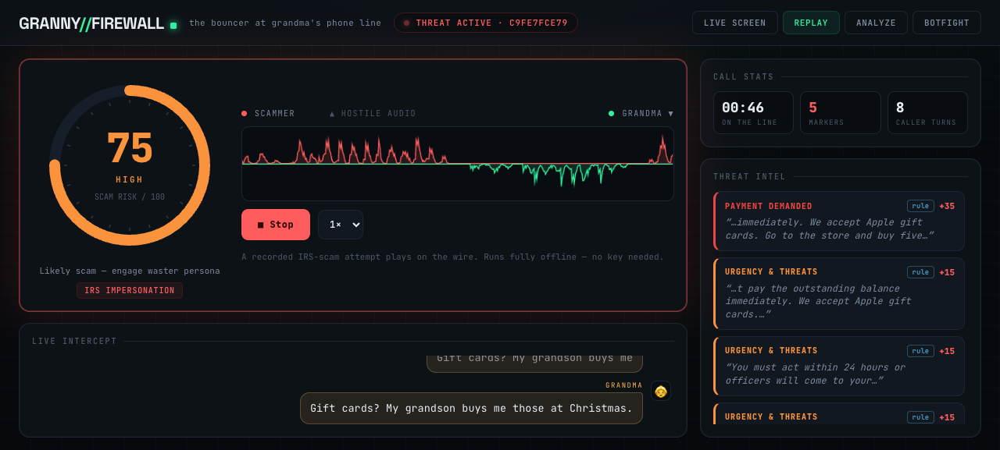
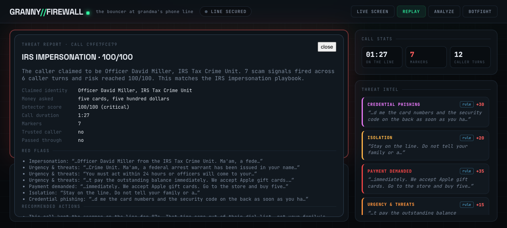

# 🛡 Granny Firewall

**The bouncer at your grandmother's front door — for her phone.**

An AI call-screening firewall built on AssemblyAI for the
[Voice Agent Hackathon](https://lablab.ai/ai-hackathons/assemblyai-voice-agent-hackathon)
(lablab.ai, Sep 2026).

Unknown callers are intercepted by a voice-agent gatekeeper *before* grandma's
phone rings. Scam signatures light up a live dashboard mid-sentence. When the
risk score crosses the line, the agent flips into a confused-elder honeypot
persona and wastes the scammer's time. Legit callers pass with a family
codeword. Every call ends with a structured threat report.





## Demo modes

| Mode | What it does |
|---|---|
| 📻 **Replay** | The bundled `irs_scam_call.wav` plays on the wire in real time — audio, streaming transcript, markers, risk dial, verdict. **Runs fully offline, no API key needed.** Best first demo. |
| 🎙 **Live screen** | Talk to the firewall from your browser mic. Play the scammer — or say the codeword and get passed through. |
| 📼 **Analyze** | Stream a call recording through Universal-Streaming; regex rules + per-turn LLM Gateway classification flag markers live. Upload your own or pick a bundled sample. |
| 🤖 **Botfight** | A scripted scammer voice agent calls the firewall — two AIs duel, both sides audible, fully deterministic. No telephony required. |

## AssemblyAI inside

- **Voice Agent API** — one WebSocket: STT (Universal-3.5 Pro Realtime) + LLM +
  TTS + neural turn detection + tool calling. Tools: `flag_marker`,
  `verify_codeword`, `pass_to_family`, `set_persona`, `whisper_alert`,
  `end_call`, `get_risk_assessment`.
- **Universal-Streaming** — powers Analyze mode (`universal-streaming-english`,
  pcm_s16le @16kHz).
- **LLM Gateway** — per-turn scam classification inside the streaming session
  (`llm_gateway` param) *and* the post-call structured verdict via
  `llm-gateway.assemblyai.com/v1/chat/completions`.
- **Speech Understanding** — post-call speaker labels, sentiment, entities,
  highlights, IAB topics, PII redaction.

## Setup

```bash
# 1. API key — free $50 credit, no card: https://www.assemblyai.com/dashboard/signup
cp .env.example .env   # paste your key; set FAMILY_CODEWORD

# 2. backend
uv venv .venv && uv pip install -r requirements.txt --python .venv/bin/python

# 3. frontend
cd frontend && npm install && cd ..
```

## Run

```bash
# terminal 1 — backend on :8008
cd backend && ../.venv/bin/python -m uvicorn server:app --port 8008

# terminal 2 — frontend dev server on :5173 (proxies /api + /ws)
cd frontend && npm run dev
```

Open http://localhost:5173. For a production-style single server:
`cd frontend && npm run build`, then just run the backend — it serves `dist/`.

## Test

```bash
.venv/bin/python -m pytest tests/ -q     # detector unit tests (no key needed)
.venv/bin/python -m ruff check backend/ tests/
```

## Demo script for judges

1. **Replay** → press one button. The recorded IRS-scam call plays on the wire;
   markers land mid-sentence, the dial climbs to CRITICAL, the stage pulses red,
   and the threat report appears. Works with no API key.
2. **Live** → judge role-plays a scammer (or the codeword-carrying grandchild).
   Show `verify_codeword` passing a real caller, then a scam attempt flipping
   the agent into waster mode.
3. **Analyze** → pick `irs_scam_call.wav` at 2× — same call screened through
   Universal-Streaming with per-turn LLM Gateway classification.
4. **Botfight** → the scripted scammer agent calls in and the firewall handles
   it end-to-end — the deterministic live demo.
5. Threat report card appears automatically after every call: scam type,
   entities, red flags, recommended actions.

## Cost

~$4.50/hr per Voice Agent session (botfight = two sessions) + $0.15/hr
streaming + cents per LLM Gateway call. The $50 signup credit covers many
hours of demos and rehearsals.

## Repo layout

```
backend/    FastAPI + Voice Agent/Streaming/LLM-Gateway clients + detector
frontend/   React+Vite security-console dashboard
samples/    bundled demo call(s) + per-line timing sidecar
tests/      detector fixtures + unit tests
scripts/    sample generator (macOS `say`), audio converter
docs/       screenshots
```

## Try it

Fastest: run the backend, build the frontend, press **Replay** in the UI —
the bundled IRS-scam call plays on the wire end to end with no API key.

Fully live: set `ASSEMBLYAI_API_KEY` in `.env`, then call a Twilio number
pointed at `/twilio/voice` (μ-law streams straight into the Voice Agent
session, no transcoding) or press **Live screen** and run a scam through
your browser mic. Say the family codeword to get passed through.
